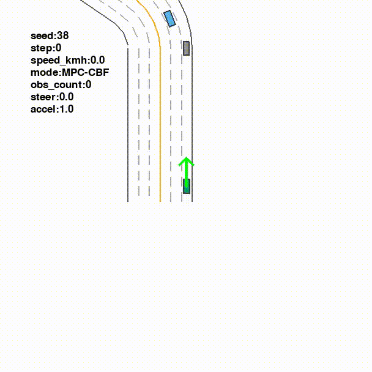

# Safe Autonomous Driving : Comparison of MPC-CBF and RL controllers

**Author:** Santiago Parra  
**Year:** 2026

This project develops a MPC controller combined with a Control Barrier Function (CBF), and compares it with a RL based controller for autonomous driving with Metadrive.

## MPC-CBF Controller : Formulation of the problem

The MPC controller is a classic controller an intuitive perspective for control driving. Given a time horizon T, the idea is to solve the following optimization problem for every time step of the simulation:

$\min J(u) = \sum_{k=1}^N \omega_P J_{pos}(x_k) + \omega_S J_{speed}(x_k) + \omega_U J_{control}(u_k)$

Where $x_k$ represents the state of the vehicle and $u_k$ represents the sequence of actions / controls that guide the vehicle. The weights $\omega_P$, $\omega_S$ and $\omega_U$ penalize the position, the speed and the control respectively.

This cost function represents the desired behaviour of the vehicle (go straight in the lane, go at a reasonable speed, don't do sudden moves, etc).
The optimization should be subject to the following constraints:

- The dynamics of the system: Represents the reaction of the vehicle when we choose an action $$x_{k+1} = f(x_k, u_k)$$
- The Control Barrier Function (CBF): We create a barrier around each obstacle that the vehicle cannot cross, we represent this behaviour by a positive barrier function $h(x) \geq 0$. In order to guarantee the positivity, when solving the optimization problem we impose:
  $$h(x_{k+1}) \ge (1 - \gamma) h(x_k)$$
- Limits of the control: As the control represents a real life action, it should be bounded (for example, the steer cannot exceed 45° or the acceleration has a maximum limit). We represent this by a normalized constraint for the controls
  $$-1 \leq u_k \leq 1 \hspace{10pt}$$

Which are taken for each $k = 1, 2, \dots N$ i.e for each instant of the time horizon.

In our implementation, we perform a LTV approximation in order to transform the optimization problem into an Quadratic Programming (QP) problem. In the end we solve a system of the form:

$$\min \frac{1}{2} U^T P U + q^T U$$ 

Subject to a linear constraint $l \leq A U \leq u$ that encapsulates the CBF constraint and the physical limit of the control.

## RL Controller

In addition to the MPC-CBF, we trained a PPO Controller using the $stable\_baselines3$ package. We trained the model for 250000 steps with 50 different scenarios

## Experiments

For the experiments, we considered a $N = 15$, $\Delta t = 0.1$, a $\gamma = 0.2$ and the Kinematic Bycicle model, where the control is given by the acceleration and steer of the vehicle.